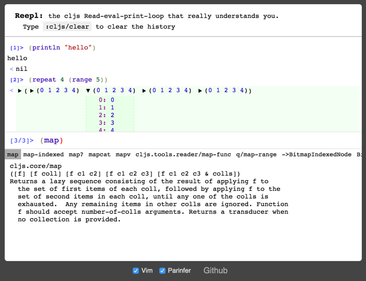

# Reepl
The cljs Read-eval-print-loop that really understands you

## [Try it](https://jaredforsyth.com/reepl)

### Features

- auto-completion
- rich formatting of cljs objects
- parinfer

`src/reepl/example.cljs` is the `main` on that page, and you can see how this lib can be used.

## Building yourself
Grab the latest `boot` (version 2.5.5 at the time of writing), run `boot dev`, and then open `http://localhost:3002`.

## Things you can configure

- how statements are eval'd (replumb-based setup available for your convenience)
- how completion works (replumb-based fn used in the example has completion for `js/` as well!)
- how documentation is gotten (the example uses a custom impl based on cljs source)
- how values are displayed (the example uses [cljs-devtools](https://github.com/binaryage/cljs-devtools) for formatting most things)

## Extra Dependencies

- codemirror: you can see in `build.boot` how to get the css imported correctly
- parinfer-codemirror: check out the `build.boot` for this too, and I'm currently using a [custom fork](https://github.com/jaredly/codemirror-parinfer)

